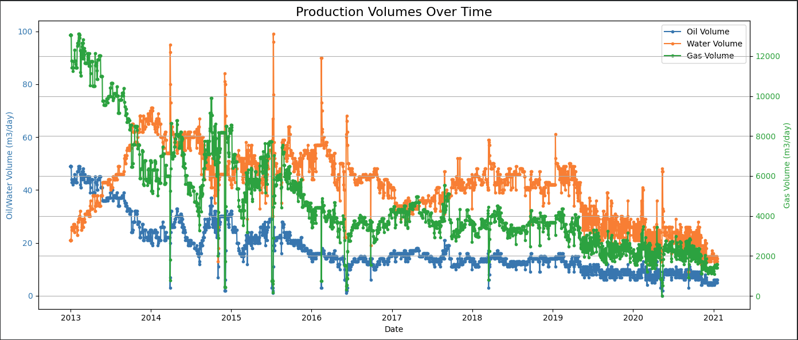
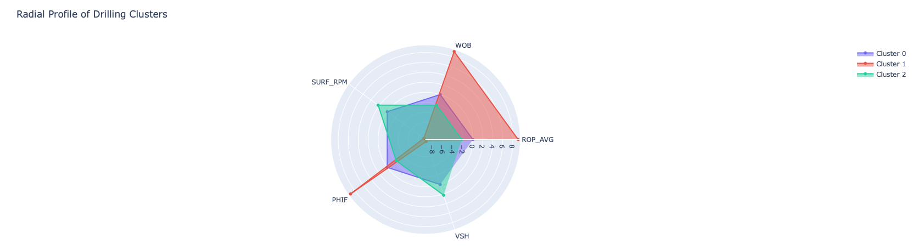
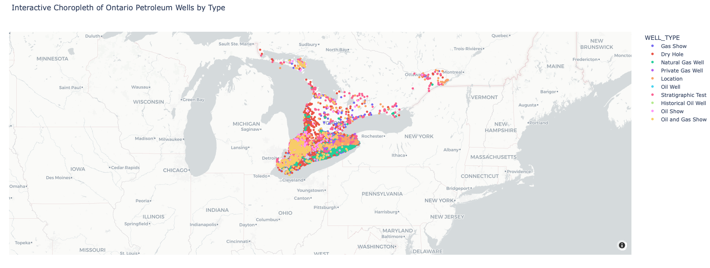
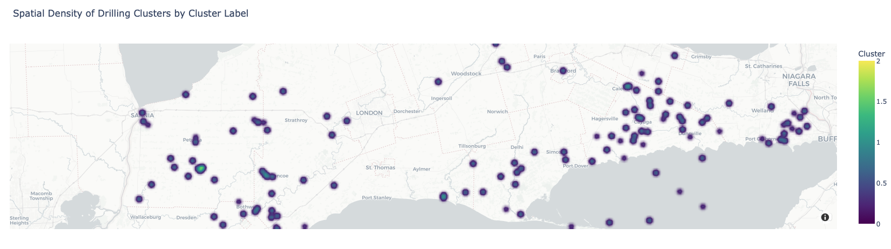

# Oil Well Production Optimization & Drilling Efficiency Analysis

> A comprehensive Business Intelligence and Data Analytics project that explores oil well production performance, drilling efficiency, geospatial distribution, and machine learning clustering using Python and interactive visualizations.


---

# Project Overview

Oil and gas companies continuously monitor drilling performance and well production to maximize recovery while minimizing operational costs.

This project integrates drilling logs, oil production data, and geospatial analysis into an interactive Business Intelligence solution. Using Python for data preprocessing and Tableau for visualization, the project identifies production trends, drilling efficiency patterns, spatial distribution of wells, and operational clusters.

The analysis combines traditional data analytics with machine learning techniques to generate actionable insights for engineers and decision-makers.

---

# Business Objectives

- Evaluate oil production performance across wells.
- Analyze drilling efficiency using Rate of Penetration (ROP).
- Identify production trends and operational bottlenecks.
- Visualize spatial distribution of oil wells across Ontario.
- Discover production patterns using K-Means clustering.
- Support data-driven operational decision making.

---

# Dataset

## Source of Datasets

- **ROP Dataset:** https://www.kaggle.com/datasets/ahmedelbashir99/drilling-log-dataset
- **Oil Well Production Dataset:** https://www.kaggle.com/datasets/ruslanzalevskikh/oil-well
- **Ontario Shapefile:** https://open.canada.ca/data/dataset/235fcd04-6632-4cce-a403-556089cc4276/resource/d5fbee67-c36a-4044-997d-ebe809a0073a

---

# Technologies Used

- Python
- Pandas
- NumPy
- GeoPandas
- Scikit-Learn
- K-Means Clustering
- Tableau Desktop
- Tableau Maps
- Jupyter Notebook

---

# Project Workflow

```
Data Collection
        │
        ▼
Data Cleaning & Preprocessing
        │
        ▼
Exploratory Data Analysis
        │
        ▼
Feature Engineering
        │
        ▼
Machine Learning Clustering
        │
        ▼
Geospatial Analysis
        │
        ▼
Interactive Tableau Dashboards
        │
        ▼
Business Insights & Recommendations
```

---

# Dashboard 1 — Oil Production Performance

This dashboard provides an executive overview of oil production performance across all wells.

### Key Metrics

- Total Oil Production
- Average Production
- Highest Producing Wells
- Production Distribution
- Production Trends



### Insights

- Production varies significantly across wells.
- A small percentage of wells contribute the majority of production.
- Several wells consistently outperform the field average.
- Production distribution is highly skewed.

---

# Dashboard 2 — Drilling Performance

This dashboard evaluates drilling efficiency and operational performance.

### Key Metrics

- Rate of Penetration (ROP)
- Drilling Depth
- Drilling Time
- Operational Performance
- Drilling Trend Analysis



### Insights

- Higher ROP generally reduces drilling time.
- Certain drilling intervals exhibit reduced efficiency.
- Operational performance varies across drilling phases.
- Optimization opportunities exist during slower drilling periods.

---

# Dashboard 3 — Geospatial Analysis

This dashboard visualizes oil well locations and production performance geographically.

### Key Metrics

- Oil Well Distribution
- Regional Production
- Geographic Clusters
- Spatial Density
- Production by Location



### Insights

- Production is concentrated within specific Ontario regions.
- Geographic clustering reveals operational hotspots.
- Regional differences indicate varying reservoir characteristics.
- Spatial visualization supports infrastructure planning.

---

# Dashboard 4 — Machine Learning Clustering

K-Means clustering groups oil wells with similar production characteristics.

### Key Metrics

- Production Clusters
- Well Similarity
- Cluster Distribution
- High-Performance Wells
- Low-Performance Wells



### Insights

- Four distinct operational clusters were identified.
- High-producing wells share similar operational characteristics.
- Low-performing wells represent opportunities for optimization.
- Cluster analysis supports production forecasting and maintenance planning.

---

# Business Insights

- Oil production is concentrated among a limited number of high-performing wells.
- Drilling efficiency significantly impacts overall production performance.
- Geographic analysis reveals production hotspots across Ontario.
- Machine learning successfully identifies operational patterns.
- Combining production, drilling, and spatial analytics improves operational visibility.

---

# Business Recommendations

- Prioritize maintenance for high-performing wells.
- Investigate operational practices from successful drilling operations.
- Allocate resources toward high-potential production regions.
- Monitor drilling efficiency continuously using ROP dashboards.
- Utilize clustering results for predictive maintenance and production planning.

---

# Repository Structure

```
Oil-Well-Production-Optimization-and-Drilling-Efficiency-Visualization
│
├── images/
│   ├── oil-production-dashboard.png
│   ├── Drilling.png
│   ├── geospatial-dashboard.png
│   └── clustering-results.png
│
├── notebooks/
│   └── Oil_Well_Analysis.ipynb
│
├── reports/
│   └── Business_Intelligence_Report.pdf
│
├── data/
│   └── Dataset Links.txt
│
└── README.md
```

---

# Future Improvements

- Predict oil production using machine learning regression models.
- Develop real-time production dashboards.
- Integrate drilling sensor streaming data.
- Implement anomaly detection for drilling operations.
- Deploy dashboards using Tableau Public.

---

# Skills Demonstrated

- Business Intelligence
- Data Analytics
- Exploratory Data Analysis
- Data Cleaning
- Feature Engineering
- Machine Learning
- K-Means Clustering
- Geospatial Analytics
- Dashboard Design
- Tableau
- Python
- Pandas
- GeoPandas
- Data Storytelling

---

# Author

**Richard Amarachi Chijioke**

Master of Data Science

Mechanical Engineer

**Data Analyst | Business Intelligence | Machine Learning | Tableau | Python | SQL**

---

⭐ **If you found this project useful, consider giving the repository a star!**

